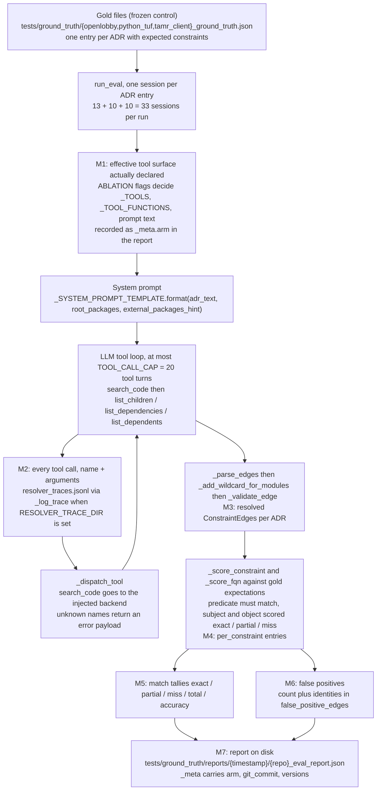

# Ablation plan: ADR-constraint resolver tool surface (issue #131)

Design document for the ablation asked for by eval.md 2026-09-05 (post-#128 row, "Ablation dimension (designed, not yet run)") and GitHub issue #131. Nothing here has been run. Arms, metrics, and the per-arm run count (2 runs per arm, plus 1 approved traced baseline run) have been reviewed and signed off in issue #131 per its acceptance criterion 1, so this document is now the execution reference; the remaining open decisions are the routings in section 6 that depend on run outcomes.

Scope: the ingestion group only (`pytest -m resolver_eval`, harness `app/tests/services/adg/test_unified_resolver_eval.py`). The retrieval group (`pytest -m cpt_eval`, harness `app/tests/services/cpt/test_cpt_detect_eval.py`) is out of scope and stays untouched: it runs on gold constraints from `tests/ground_truth/`, not on resolver output, and eval.md records it as byte-identical across #128. #128 changed the resolver only, so the retrieval group cannot measure anything about the tool surface.

Following the rag-eval ablation rules: one variable per variant, the gold set is the control (the same three `tests/ground_truth/<repo>_ground_truth.json` files score every arm, unchanged), the baseline row exists already, every variant runs the full metric set, deltas are reported per segment (per repo here, never one system-wide number), the difference margin is stated before running, and there is a stop rule.

## 1. Question and arms

Two questions, one arm each:

- **Q1 (recall question).** How much does `search_code` contribute? Does lifting semble snippets to FQN handles actually ground constraint subjects/objects at the right locus, or do the typed neighborhood tools (`list_children`, `list_dependencies`, `list_dependents`) plus the root-package list in the system prompt suffice? ADR 017 decision 1 made search the entry point; #131 and the eval.md row ask whether that is earned by measurement.
- **Q2 (tool-count question).** Does `list_dependents` earn its place? It is the one tool in the ADR 017 surface added without a demonstrated need (ADR 017 decision 2 table lists it as "who uses it? (subject scoping)" with no supporting incident). The delta it makes is the justification either way.

### Variant definition table

| Variant | The exact one change vs baseline | Held constant | Expected effect and why | Added latency | Added cost/session |
|---|---|---|---|---|---|
| baseline | none; the committed post-#128/#130 configuration, already measured 4 times | not applicable | not applicable | already spent | already spent |
| v1 `search_off` | the search backend handed to `resolve_adr_constraints` is a stub returning `[]`, so every `search_code` call succeeds and returns no hits. The tool stays declared, the prompt stays identical, the neighborhood tools stay identical | same harness, same gold files, same model (`google/gemini-3.1-flash-lite` via OpenRouter), same `TOOL_CALL_CAP = 20`, same prompt text, same three neighborhood tools, same `PYTHONHASHSEED=0` | match tallies degrade toward `miss` and/or FP count moves: subject-locus grounding disappears, so the agent grounds on root packages and file browses instead of snippets. The entry-point FP class is expected to drop but not necessarily to 0, because it has a second source, the root-package list in the prompt (noxfile, docs, and examples are root segments); a surviving count is a finding, not a broken toggle | negative: the semble index build is skipped per repo | less than or equal to baseline: the session shape, model, and call cap are unchanged, the agent still pays one round trip per `search_code` attempt, and empty tool results shrink input tokens relative to baseline snippet payloads |
| v2 `dependents_off` | `list_dependents` is removed from the declared tool surface, from the dispatch table, and from every prompt/tool-description sentence that names it (five surfaces, see section 2) | identical to baseline except the tool surface and the two prompt/tool-description strings that name the removed tool | expected no measurable effect. If there is one, it shows up as a subject-locus shift (the agent loses the "who uses it" direction when choosing the subject wildcard level) | not measurable: the harness records no timing field | identical per session; one fewer tool schema entry is negligible |

The combined variant (`search_off` + `dependents_off`) is deliberately out of scope: per-component attribution is the point of #131, and a bundle variant would confound both arms. The flag design in section 2 makes the combination possible, but this plan does not request it.

### Baseline arm (not re-run)

The baseline is the four existing runs at resolver code unchanged since commit `40b1c9f` (verified: `git log -- app/services/adg/unified_resolver.py app/services/adg/search.py` shows no resolver change after `40b1c9f`). They are committed on disk, and this plan reuses them instead of re-running:

| Run dir (`tests/ground_truth/reports/`) | `_meta.git_commit` | Version stamping |
|---|---|---|
| `2026-09-05T22-31-58` | `40b1c9f` | pre-#130 (no version keys) |
| `2026-09-05T22-50-14` | `8c02aea` | pre-#130 (no version keys) |
| `2026-09-05T22-53-37` | `8c02aea` | pre-#130 (no version keys) |
| `2026-09-06T09-40-13` | `8c02aea` | #130 stamped: semble 0.5.6, semble model `minishlab/potion-code-16M-v2`, resolver model `google/gemini-3.1-flash-lite` |

Footnote on the stamped run: `2026-09-06T09-40-13` carries `_meta.git_commit` `8c02aea` while already holding the #130 version keys, that is, it ran at a dirty working tree before the stamping change `7703bb1` landed. `_meta.git_commit` alone therefore does not prove which stamping code a run had; the presence of the version keys in `_meta` is the evidence that stamping ran.

Baseline numbers per real repo (from those four reports, and the top-level committed baselines `tests/ground_truth/<repo>_eval_report.json`):

| Repo (gold) | ADR sessions | Expected constraints | exact / partial / miss (identical in all 4 runs) | false_positives across the 4 runs | accuracy (committed) |
|---|---|---|---|---|---|
| openlobby | 13 | 10 | 2 / 5 / 3 | 16 / 16 / 18 / 16 | 0.45 |
| tamr-client | 10 | 1 | 0 / 0 / 1 | 32 / 36 / 31 / 32 | 0.0 |
| python-tuf | 10 | 4 | 3 / 0 / 1 | 3 / 3 / 3 / 4 | 0.75 |

The ±2 FP band per repo in that last column is the measured noise floor from the #130 row of eval.md. It is the only threshold input this plan is allowed to use.

### Out of scope

- The retrieval group (`cpt_eval`), for the reason in the preamble.
- Synthetic smoke repos flask and django (`repos/flask`, `repos/django`): eval.md marks them smoke-only, excluded from every gated denominator. Ablation runs filter them out (section 7), so no flask/django rows are produced. Their absence from the ablation record is deliberate, not a failure.
- Any prompt improvement, in particular the entry-point-subject prompt rule named as the remedy candidate in the post-#128 row. The ablation must run before any prompt change so its effect is not confounded; that ordering is stated in the eval.md row and is a hard precondition in section 7.
- Any change to `app/services/adg/unified_resolver.py` or `app/services/adg/search.py` semantics (see section 2 for what may and may not change).
- Re-recording the committed baselines, and any re-run of the baseline arm.

## 2. Toggle implementation

### Mechanism decision

Both arms are one environment flag per arm, read by the eval harness. The flags are applied inside `run_eval` in `app/tests/services/adg/test_unified_resolver_eval.py`, and the report stamp reads them in `app/tests/eval_paths.py`. No production code changes.

Reason, against the two alternatives:

- **Environment flags read inside `resolve_adr_constraints` / at import of `unified_resolver`.** Rejected: `unified_resolver.py` is imported by production paths (`app/services/adg/__init__.py` imports `search`, and the pipeline imports the resolver) and by the unit test modules (`app/tests/services/adg/test_unified_resolver.py`, `app/tests/services/adg/test_search.py`). A module-level mutation would change tool-surface behavior for anything else in the same pytest process or the same service process, which risks the committed baseline comparability and is a production branch for an eval-only concern.
- **A new keyword parameter threaded through `resolve_adr_constraints`.** Rejected: it changes a production signature for a measurement concern. ADR 017 decision 6 already put one parameter in (`search_backend`) because that seam doubles as the unit-test boundary; there is no such dual use for "which tools exist today". It also forces the prompt template to grow conditional prose inside production code.
- **Environment flags read by the eval harness, applied with `unittest.mock.patch.object` inside `run_eval`.** Chosen: the tool surface (`_TOOLS`, `_TOOL_FUNCTIONS`) and the prompt (`_SYSTEM_PROMPT_TEMPLATE`) are module-level constants in `app/services/adg/unified_resolver.py`, so a test-side patch reaches everything the LLM session sees without touching production bytes. The patch is scoped to the eval loop only, so even a full-suite run with the flag set leaves unit tests unaffected after the loop exits. It keeps the arms as one-flag runs of one harness, which is what the eval.md row requires, and `git diff` on `app/services/` stays empty, which is what baseline comparability requires.

Flag names (both default to unset = baseline behavior):

- `ABLATION_SEARCH_OFF=1` for v1
- `ABLATION_DEPENDENTS_OFF=1` for v2

### v1 `search_off`: one line at the existing seam

`run_eval` builds the backend at line 183 of `app/tests/services/adg/test_unified_resolver_eval.py`:

```python
def _empty_search_backend(query: str, top_k: int = 10) -> list[dict]:
    """v1 search_off arm: the tool stays declared and callable, the recall is gone."""
    return []
```

and in `run_eval`:

```python
if ABLATION_SEARCH_OFF:
    search_backend = _empty_search_backend
else:
    search_backend = build_search_backend(repo_root, adg)
```

Details that matter:

- The stub keeps the real backend's signature `(query, top_k=10)`, matching `SearchCallable` in `app/services/adg/search.py`, because `_TOOL_FUNCTIONS["search_code"]` calls `backend(args["query"])` positionally. Unit tests already inject stubs at this seam (`_stub_backend` in `app/tests/services/adg/test_unified_resolver.py`), so this is the established pattern.
- The stub returns `[]` and must never raise: `_dispatch_tool` calls the handler without a try/except, so a raising backend would crash the session rather than degrade it.
- Nothing else changes. The `search_code` tool stays in `_TOOLS` and the prompt still says "Start with search_code". The arm must measure the recall loss, not tool availability, so removing the tool or the prompt instruction would change two variables. Because the call still happens and still costs a round trip, any measured delta is attributable to the empty result, not to a shorter session.
- Side benefit: `build_search_backend` is never called, so the semble index is not built and the Hugging Face model cache is not needed for v1 runs.

### v2 `dependents_off`: five surfaces, not one

Removing the tool naively (only from `_TOOLS`) contaminates the arm, because the agent still sees the name in three prose places and still gets real data if it calls the name anyway. The complete list of surfaces that name `list_dependents` inside an LLM session, with the exact in-memory strings verified against the current prompt:

1. `_TOOLS[3]` in `unified_resolver.py`: the `list_dependents` tool schema entry (the agent may not call an undeclared tool, but if it does, see surface 2).
2. `_TOOL_FUNCTIONS["list_dependents"]`: the dispatch handler. This one is the real trap: `_dispatch_tool` looks the name up in `_TOOL_FUNCTIONS`, not in `_TOOLS`, so if only `_TOOLS` is patched, a hallucinated `list_dependents` call returns **real data** and silently contaminates the arm. The handler must go too, so a hallucinated call hits the existing `{"error": "unknown tool: list_dependents"}` branch, which is visible in the trace as a contamination signal instead of silently succeeding.
3. The `search_code` tool description (`_TOOLS[0]["function"]["description"]`), which ends with: `then inspect the hits with list_children / list_dependencies / list_dependents.`
4. The system prompt "Required exploration" paragraph (`_SYSTEM_PROMPT_TEMPLATE`), which reads: `Start with search_code to find where an ADR concept lives in the code (hits come back as FQN handles with snippets), then inspect the neighborhood with list_children, list_dependencies, and list_dependents to confirm the exact FQNs before writing a constraint.`
5. The system prompt Example 2 step: `Step 2: list_dependents("app.middleware.auth.AuthMiddleware") → who already uses it`. This step is deleted rather than substituted, because substituting a different tool changes what the example teaches; the arm models "the tool does not exist", and a one-step example is still a valid example.

(The module docstring and `resolve_adr_constraints`'s docstring also name the tool, but the LLM never sees docstrings, so they are not part of the arm.)

Implementation, in `app/tests/services/adg/test_unified_resolver_eval.py`:

```python
ABLATION_SEARCH_OFF = os.environ.get("ABLATION_SEARCH_OFF", "") not in ("", "0")
ABLATION_DEPENDENTS_OFF = os.environ.get("ABLATION_DEPENDENTS_OFF", "") not in ("", "0")

_NEIGHBORHOOD_SENTENCE_WITH_DEPENDENTS = (
    "then inspect the neighborhood with list_children, "
    "list_dependencies, and list_dependents to confirm the exact FQNs"
)
_NEIGHBORHOOD_SENTENCE_WITHOUT_DEPENDENTS = (
    "then inspect the neighborhood with list_children "
    "and list_dependencies to confirm the exact FQNs"
)
_EXAMPLE_STEP_WITH_DEPENDENTS = (
    'Step 2: list_dependents("app.middleware.auth.AuthMiddleware") → who already uses it'
)
_SEARCH_DESCRIPTION_WITH_DEPENDENTS = (
    "then inspect the hits with list_children / list_dependencies / list_dependents."
)
_SEARCH_DESCRIPTION_WITHOUT_DEPENDENTS = (
    "then inspect the hits with list_children / list_dependencies."
)


def _dependents_off_prompt_template() -> str:
    original_template = unified_resolver._SYSTEM_PROMPT_TEMPLATE
    prompt_template = original_template
    for old_text, new_text in (
        (_NEIGHBORHOOD_SENTENCE_WITH_DEPENDENTS, _NEIGHBORHOOD_SENTENCE_WITHOUT_DEPENDENTS),
        (_EXAMPLE_STEP_WITH_DEPENDENTS, ""),
    ):
        assert old_text in prompt_template, f"prompt drift, scrub no longer matches: {old_text!r}"
        prompt_template = prompt_template.replace(old_text, new_text)
    assert "list_dependents" not in prompt_template, "prompt scrub incomplete"
    return prompt_template


def _dependents_off_tools() -> list[dict]:
    tools = []
    for tool in unified_resolver._TOOLS:
        if tool["function"]["name"] == "list_dependents":
            continue
        description = tool["function"]["description"]
        if _SEARCH_DESCRIPTION_WITH_DEPENDENTS in description:
            description = description.replace(
                _SEARCH_DESCRIPTION_WITH_DEPENDENTS,
                _SEARCH_DESCRIPTION_WITHOUT_DEPENDENTS,
            )
        assert "list_dependents" not in description, "tool description scrub incomplete"
        tools.append({**tool, "function": {**tool["function"], "description": description}})
    assert len(tools) == 3, f"expected 3 tools after scrub, got {len(tools)}"
    return tools


@contextmanager
def _ablation_tool_surface():
    """Apply the arm's surface edits for the duration of the eval loop only."""
    if not ABLATION_DEPENDENTS_OFF:
        yield
        return
    dependents_off_tools = _dependents_off_tools()
    dependents_off_prompt_template = _dependents_off_prompt_template()
    dependents_off_handlers = {
        handler_name: handler
        for handler_name, handler in unified_resolver._TOOL_FUNCTIONS.items()
        if handler_name != "list_dependents"
    }
    with patch.object(unified_resolver, "_TOOLS", dependents_off_tools), \
         patch.object(unified_resolver, "_TOOL_FUNCTIONS", dependents_off_handlers), \
         patch.object(unified_resolver, "_SYSTEM_PROMPT_TEMPLATE", dependents_off_prompt_template):
        yield
```

and `run_eval` wraps its session loop:

```python
    result = EvalResult()
    with _ablation_tool_surface():
        for fixture in ground_truth:
            ...
```

Why the asserts are load-bearing and not decoration: the prompt scrub is a string match against today's prompt text. If the prompt changes later (which is expected, the entry-point prompt rule is the named next pass), `str.replace` silently no-ops and the arm would run with `list_dependents` still named in the prompt, exactly the contamination the arm exists to avoid. The `old_text in prompt_template` asserts fail loudly on drift, and the `"list_dependents" not in prompt_template` assert is the complete scrub check, since all three prose occurrences contain that substring.

### Report stamping

`app/tests/eval_paths.py` gains the arm label so every report is distinguishable without guessing from tallies:

```python
def _ablation_arm() -> str:
    search_off = os.environ.get("ABLATION_SEARCH_OFF", "") not in ("", "0")
    dependents_off = os.environ.get("ABLATION_DEPENDENTS_OFF", "") not in ("", "0")
    if not search_off and not dependents_off:
        return "baseline"
    arms = []
    if search_off:
        arms.append("search_off")
    if dependents_off:
        arms.append("dependents_off")
    return "+".join(arms)
```

and `write_report` adds `"arm": _ablation_arm(),` to the `_meta` dict it already builds. Today `_meta` carries `generated_at`, `git_commit`, and (post-#130) `semble_version`, `semble_model`, `resolver_model`; the arm joins them as `_meta.arm`. This stamps `cpt_eval` reports too if the flags are ever set during a retrieval run, which is harmless metadata; the checklist still says never set the flags outside `resolver_eval` runs.

## 3. Measurement points

One resolver session per ADR. The flow below is the real code path in `app/services/adg/unified_resolver.py` and `app/tests/services/adg/test_unified_resolver_eval.py`, with ablation-relevant capture points marked M1 to M7.



Notes on the capture points:

- **M1** is where the arm exists. It is enforced by the asserts in section 2 before the first session and recorded in the report as `_meta.arm`, so a report file is self-describing about which surface produced it.
- **M2** is not written by default: `_log_trace` writes only when `RESOLVER_TRACE_DIR` is set (default is the current directory, which would pollute `app/`). Ablation runs set it per run (section 7). This is the only place the arm's mechanism evidence lives: whether `search_code` was still called and how often, and whether `list_dependents` was ever attempted after removal.
- **M3** is only partially visible in the report: matched resolved edges appear in `per_constraint[].resolved_subject` / `resolved_object`, unmatched ones in `false_positive_edges`. Edges dropped by `_validate_edge` appear in no report field; they are visible only in the trace's `pre_validation_edges` with their `valid` flag. This is why the trace run matters for interpreting a `miss`.
- **M5/M6** are the decision metrics; everything else is diagnostic.

## 4. Metric table

Every metric consumes a field of `tests/ground_truth/reports/{timestamp}/{repo}_eval_report.json` (written by `write_report` in `app/tests/eval_paths.py` from `EvalResult.to_report`) or of `resolver_traces.jsonl` (written by `_log_trace` in `app/services/adg/unified_resolver.py`). Per the ablation rule, all arms run the identical metric set; nothing is trimmed per arm. Per repo, per arm, per run; never one system-wide number.

| Metric | Measurement point | What it measures | Exact computation | Report field consumed | Arm question |
|---|---|---|---|---|---|
| Match tallies | M5 | FQN grounding quality of the resolver under the arm: how many expected constraints come out exact, partial (ancestor-descendant tolerance), or missed | Read the aggregates; cross-check that `exact + partial + miss == total` and that the counts equal a tally of `per_constraint[].score` values in `{"exact_match", "partial_match", "miss"}` | `exact`, `partial`, `miss`, `total` (+ `per_constraint[].score`) | Q1 primary, Q2 primary |
| Accuracy | M5 | The weighted rate eval.md quotes in every baseline row | Already computed in the report as `(exact + 0.5 * partial) / total`, rounded to 4 decimals | `accuracy` | Q1 and Q2, reported only. It carries no information beyond the tallies, so no decision rule reads it |
| False positive count | M6 | Over-extraction under the arm: resolved edges matched to no expectation | Read the count; the count equals `len(false_positive_edges)` | `false_positives` | Q1 primary (direction not assumed), Q2 primary |
| Entry-point FP class count | M6 | The post-#128 class: whole-codebase policy constraints grounded on file-entry-point subjects instead of package roots, which is what `search_code` lift produced | Count entries of `false_positive_edges` where `subject.split(".")[0]` is in the fixed set `{"manage", "setup", "noxfile", "docs", "examples", "conftest", "scripts", "pytest"}`. Baseline values under exactly this predicate, from the four committed runs: openlobby 9 / 9 / 10 / 9, tamr-client 12 / 12 / 11 / 12, python-tuf 0 / 0 / 0 / 0 | `false_positive_edges[].subject` | Q1 primary, Q2 sanity check |
| tamr policy-class requires count | M6 | Requires edges from tooling ADRs whose gold entries hold zero constraints (the class triaged since post-#123). Reported so an arm's FP delta is not mistaken for a change in this class | Count entries of `false_positive_edges` where `predicate == "requires_dependency"` and `object` is in `{"flake8", "flake8-import-order", "black", "poetry", "nox", "sphinx", "recommonmark", "dataclasses"}`. Baseline value under this predicate in the committed run `2026-09-05T22-31-58`: 21 (5 on `docs.*`, 4 on `noxfile.*`, 3 on `examples.*` subjects, 5 on `tamr_client.*`, 4 on `tamr_unify_client.*`). Note this mechanical count is larger than the 14 quoted in the 2026-09-05 row, which was a hand triage of the pre-#128 run; the mechanical predicate is what the ablation uses so it is reproducible | `false_positive_edges[].predicate`, `.object` | Neither arm. Confound control only |
| tamr many-to-one count | M6 | ADR-0009's single mandate fragmented into per-module subjects that jointly embody the gold constraint but score as false positives while the one broad expectation scores miss (the scoring gap triaged in the 2026-09-05 row) | Count entries of `false_positive_edges` where `predicate == "requires_dependency"` and `object == "tamr_client._types.*"`, plus read the one `per_constraint` entry whose `expected.subject == "tamr_client.*"` and record its `score`. Baseline in the committed run: 10 such false positives, and the broad expectation at `miss` | `false_positive_edges[]`, `per_constraint[].expected.subject`, `per_constraint[].score` | Neither arm. Confound control only |
| `search_code` calls per session | M2 | Whether the search-off arm really kept paying for search, and how much the baseline leans on search | From the trace file, count records' `tool_calls` entries with `name == "search_code"` and divide by the number of records; a record is one ADR session | `resolver_traces.jsonl` field `tool_calls[].name` (one JSON object per line, one line per session) | Q1 mechanism check |
| `list_dependents` calls per session | M2 | Q2's real evidence: how often the tool is used at all. Must be exactly 0 in v2; any nonzero value is model noise to be recorded, since the scrub asserts already passed at arm start | Same count with `name == "list_dependents"`, counting call attempts as they appear in `tool_calls` | `resolver_traces.jsonl` field `tool_calls[].name` | Q2 mechanism check and tool-count justification |

Baseline reference for the usage metric: the committed baseline runs have no traces aligned to them (traces are not part of the report and the four baseline run directories contain only report JSONs). The existing traces on disk under `logs/reseed-129/` come from a #129 seed build, not the eval harness, so they are indicative only: `python-tuf` 12 sessions with `list_dependents` called 1 time, `tamr-client` 10 sessions with 0 calls, `flowkit` 13 sessions with 3 calls, `experimenter` 17 sessions with 1 call, `django`/`flask` 2 sessions each with 0, and no `openlobby-server` file in that directory. The flowkit counts are the only existing evidence that the tool sees real use anywhere, which makes the Q2 usage question genuinely repo-dependent rather than near-zero by default. The approved traced baseline run in section 5 replaces these indicative numbers as the comparison input.

### Metrics cut, with the reason

- Per-tool result quality (did the semble hits contain the right locus): no field records search hits or their lift results. Only the call count exists.
- Retrieval recall of the semble index itself: not logged anywhere in the harness or the resolver.
- Tokens and cost per session, and wall-clock latency per session: no field records them. The cost column in section 1 is therefore a structural estimate (same model, same `TOOL_CALL_CAP`), not a measurement.
- A tamr consolidation or scoring-gap fix metric (turning the 10 fragmentation false positives into matches): out of scope, it needs harness changes to the matching rule, which would break the gold-set-is-the-control rule.
- Anything gated: both eval groups are report-only by the standing eval.md rule.

## 5. Run count and budget

**Signed off: 2 runs per arm, 4 arm-runs total, plus 1 approved traced baseline run, plus the 4 existing baseline runs.**

Why 2, tied to the measured noise floor:

- The FP noise floor is ±2 per repo, measured over 4 runs at identical code (eval.md 2026-09-06 row: openlobby 16/16/18/16, tamr-client 32/36/31/32, python-tuf 3/3/3/4). A single run per arm cannot separate wobble from an effect, since a single FP observation lands inside that ±2 band by construction, and tamr-client's observed spread alone is 5 wide.
- 2 is the smallest N above that floor, and the cheapest N that can still show cross-run consistency: an effect must appear in both runs. Agreement between exactly two runs is a weak bar compared with agreement across three, which is precisely why the escalation valve below exists and is part of this sign-off rather than a contingency.
- Match tallies were identical in 4 of 4 baseline runs. That is an observation at N=4, not a property of the model, so it cannot license N=1 for the arms; it is exactly why the arm-side consistency requirement exists.

Escalation rule (the stop valve, and part of the run count decision): if the 2 runs of an arm disagree with each other more than the baseline disagrees with itself (for example match tallies differ between the two arm runs where the baseline had 4 identical, or an FP range wider than 5 on tamr-client), add one run at a time to that arm until the spread is stable, capped at 5 per arm. Beyond the cap, stop and take the disagreement to issue #131 as a finding rather than buying more runs. This is the ablation stop rule for this matrix: rounds stop when the two arms each have a stable spread and the keep/cut routing is decided, or when the cap is hit.

Budget:

- Sessions per run: 33 (openlobby 13, python-tuf 10, tamr-client 10 ADRs), after filtering out the synthetic repos (4 sessions) with the `-k` expression in section 7.
- LLM calls per session: at most 21, that is `TOOL_CALL_CAP = 20` tool turns plus one final answer call, or the cap-exhausted best-effort call that replaces the final answer. Many sessions end earlier.
- Per arm-run: 33 sessions, at most 693 calls. Four arm-runs: 132 sessions, at most 2772 calls.
- Traced baseline run (approved): 33 sessions, at most 693 calls, flags unset, `RESOLVER_TRACE_DIR` set. Its tallies and FP counts are extra baseline samples, not the decision baseline; its purpose is the usage evidence for Q2.
- Total program: 5 runs, 165 sessions, at most about 3465 calls.
- Model: `google/gemini-3.1-flash-lite` via OpenRouter, the cheap tier already used for the committed baselines. No other model is touched, so per-call cost is identical across arms by construction.
- v1 runs additionally skip the semble index build per repo, so they are the cheaper arm in wall-clock and need no Hugging Face cache.

The traced baseline run is approved and is part of the run matrix, not an optional add-on: it is 1 run with both flags unset and `RESOLVER_TRACE_DIR` set to its own directory under `logs/ablation-131/`, so the Q2 decision compares `list_dependents` usage against a real baseline usage number from the same harness rather than against the indicative `logs/reseed-129` counts (see section 4 for those counts and why they are indicative only).

Labeling and stamping:

- Every report carries `_meta.arm` (`baseline`, `search_off`, `dependents_off`), `_meta.git_commit`, and the #130 version keys, so a report file is unambiguous about which surface and code produced it.
- Reports land in `tests/ground_truth/reports/{timestamp}/` and are never overwritten; the top-level committed baselines `tests/ground_truth/<repo>_eval_report.json` are not written by ablation runs and must not be.
- Note one mechanical hazard: `RUN_DIR` in `app/tests/eval_paths.py` is computed at import time with second-resolution timestamps, so two pytest invocations started within the same second would share a directory. Run arms sequentially and confirm each invocation created a new directory before deleting nothing and moving on.

## 6. Pass conditions and decision rules

Ground rules, stated before any run:

- Every rule is applied per repo (openlobby, python-tuf, tamr-client) separately. There is no system-wide number in this ablation; the aggregate is exactly where a per-repo regression hides.
- FP wobble is ±2 per repo. Therefore an FP delta of 1 or 2 is **not** an effect, by construction of the measured floor. Only `|arm FP - baseline FP| >= 3` counts, and only if it holds in both runs of the arm.
- Match tallies were identical across the 4 baseline runs, so the measured tally floor is zero movement. Any tally shift is therefore an effect candidate, but only if it is consistent across both runs of the arm. A shift in 1 of 2 runs is wobble, unless the escalation rule in section 5 added runs and the shift persists in them. With N=2 the consistency bar is agreement between exactly two runs, which is a weak bar, and that is why the escalation valve is part of the signed-off design rather than a contingency.
- Direction is stated per arm below. An effect in the expected direction and an effect in the opposite direction are both effects; they route differently.
- All three repos have 15 expected constraints between them (openlobby 10, python-tuf 4, tamr-client 1), so segment sizes are small and this plan does not pretend otherwise: python-tuf's FP channel is 3 to 4 wide, so a +3 FP delta there is a doubling, and tamr-client's match channel is a single expected constraint, so tamr-client's signal is almost entirely the FP channel.

### v1 `search_off` (Q1: does search earn its place)

Expected direction: match tallies move toward `miss` (or exact/partial drop) because subject-locus grounding is gone; the entry-point FP class count drops, though not necessarily to 0, because search lift is one of two mechanisms that produce it (see the sanity paragraph below); the total FP count may move either way (root-package grounding can both remove the entry-point edges and add over-broad `requires` edges).

Entry-point class, expected direction and its competing mechanism, stated before any run: the class is **expected to drop** in v1, but it is not created only by search lift, so a nonzero v1 count is not evidence of a broken toggle. `noxfile`, `docs`, and `examples` are ADG root segments: `_root_segments` in `app/services/adg/unified_resolver.py` (lines 387-394) returns every top-level MODULE with no CONTAINS parent, so those entry points sit in the system prompt's root-package list with search fully on, and the prompt explicitly allows a subject grounded in the root package itself. The baseline's own decomposition proves the point: tamr-client's 21 policy-class requires include 12 on `docs.*` / `noxfile.*` / `examples.*` subjects with search fully on. What the eval.md post-#128 row actually shows is that the class **grew** with search (openlobby +6, tamr-client +9), not that search is its only source.

The airtight toggle check is therefore not this count but the deterministic smoke test in section 7 step 3, which costs no LLM calls and proves which surface the arm ran. What remains here is an interpretation rule: a v1 entry-point class count that stays near baseline is itself a #131 finding, and it relocates the remedy. The post-#128 row names an entry-point prompt rule as the next-pass candidate; if grounding survives the search-off stub, that prompt rule should target the root-package list in the system prompt (entry-point roots must not host whole-codebase policy subjects), not search lift.

- **Effect, keep route:** match tallies differ from the baseline invariant (openlobby 2/5/3, tamr-client 0/0/1, python-tuf 3/0/1) in both runs, in the direction of more `miss` or fewer exact/partial. Result: `search_code` is load-bearing. Keep it, and record in issue #131 which repos moved and by how much. This is the expected outcome and it is the measurement that converts ADR 017 decision 1 from a design argument into a number.
- **Effect, FP-only:** tallies unchanged but `|FP delta| >= 3` in both runs on at least one repo. Result: still an effect (search changes the extraction surface even where the gold matching does not). Route: keep, and record the direction with the class breakdown so the delta is attributed (entry-point class movement is expected and must be subtracted from the interpretation; the interesting reading is what happened to the `openlobby.*` and `tuf` subjects).
- **No effect:** tallies identical to the baseline invariant in both runs on all repos **and** `|FP delta| <= 2` on all repos. Result: route to **human review in issue #131, not an automatic cut**. Reason: a no-effect outcome would mean the neighborhood tools plus the root-package list alone achieve the same grounding, which contradicts ADR 017's core decision and its stated rationale (lookup over browse, pointer over data). That contradiction is a design-level question, not a measurement with an automatic answer, and the asymmetry is deliberate: cut evidence here would overthrow an accepted ADR on N=2 runs of a 15-constraint gold set. Record the numbers in the issue either way, per acceptance criterion 3.

### v2 `dependents_off` (Q2: does `list_dependents` earn its place)

Expected direction: none. The arm exists because the tool was added without a demonstrated need, so the null hypothesis is that nothing moves.

Usage check, evaluated first: the scrub asserts in section 2 hard-fail at arm start, so by the time any session runs, `list_dependents` is absent from the tool schema, the dispatch table, and every prompt or tool-description sentence that names it. Given that, a nonzero `list_dependents` attempt count in a v2 trace means the model emitted a name that was present on no surface it saw, which is model noise, not contamination. Record the count in the issue comment and move on; it does not trigger a re-run. Note the trace cannot show what the agent received: `_log_trace` records tool call names and arguments, edges, pre-validation edges, and the cap and parse flags, never tool results or dispatch payloads.

- **No effect (the expected outcome):** tallies identical to the baseline invariant in both runs on all repos **and** `|FP delta| <= 2` on all repos. Result: **cut recommendation, recorded with numbers** in issue #131 per acceptance criterion 3: the arm's per-repo tallies and FP counts, the entry-point class counts, and the usage evidence from the approved traced baseline run versus the v2 traces (calls per session). The actual code change of cutting the tool is a follow-up, not part of this ablation.
- **Effect:** any per-repo tally shift consistent in both runs, or `|FP delta| >= 3` in both runs on at least one repo. Result: **keep** `list_dependents`, and record which repo moved and which expected constraints changed score. Interpret the movement before accepting it: the python-tuf +1 in the baseline's fourth run was subject-locus churn inside ADR-0008's mandate (`requires_implementation` re-anchored `tuf.api.*` to a `MetaFile` self-requires), not a new class, and a v2 movement of the same shape is churn evidence, not value evidence.
- Nothing about v2 routes to human review: both outcomes produce a recorded decision, which is what the tool-count question is for.

### Cross-arm reading rules

- An arm's FP delta must be attributed against the class breakdown before it is believed: tamr-client's 32 baseline false positives decompose as 12 entry-point, 5 root-subject policy requires, 10 many-to-one, 1 `tamr_client.* requires tamr_client._beta.check`, and 4 `tamr_unify_client.*` requires, in the committed run. The last three groups do not depend on either tool, so movement inside them is churn, not arm effect.
- Both arms can be true at once (v1 effect, v2 no effect). The decisions are independent per arm; do not trade them off against each other.
- If v1 shows no effect and v2 shows no effect, that combination is itself the interesting outcome and goes to human review as a package: it would say the whole search-first surface adds nothing measurable on this gold set, which is a gold-set-sensitivity finding as much as a tool finding.

## 7. Execution checklist

Nothing here runs before sign-off on this document in issue #131 (arms, metrics, run count). Both eval groups are report-only; no threshold in this plan is enforced by CI or by any test assertion beyond the toggle sanity asserts.

1. **Preconditions.** `OPENROUTER_API_KEY` set. Semble model cached locally (needed by v2 and the optional traced baseline; v1 never builds the index). Confirm no prompt change has landed: the derived template in section 2 is pinned to today's `_SYSTEM_PROMPT_TEMPLATE` text, so if the prompt changed since this document was written, regenerate the `old_text`/`new_text` pairs from the current prompt before anything else.
2. **Branch.** One branch off main (for example `ablation-131`) containing exactly two file changes: `app/tests/services/adg/test_unified_resolver_eval.py` (flags, stub, `_ablation_tool_surface`, patches) and `app/tests/eval_paths.py` (`_ablation_arm`, `_meta.arm`). Verify before running anything:
   ```bash
   git diff --stat 40b1c9f -- app/services/
   ```
   which must print nothing: the resolver and the search backend stay byte-identical to the code that produced the committed baselines. Ablation runs must be at a commit that includes the #130 stamping (after `8c02aea`) so `_meta` carries the version keys.
3. **Toggle smoke, zero LLM budget.** Exercise the toggle mechanism directly in a plain interpreter run, not by inspecting module state, because the patches live inside `_ablation_tool_surface()` and are active only during the eval loop, and because the harness imports the resolver function directly (so `harness.unified_resolver` does not exist as an attribute). Two scripts, run from `app/`.

   v2, and this is also the deterministic toggle check that section 6 leans on:
   ```bash
   ABLATION_DEPENDENTS_OFF=1 uv run --extra dev python -c "
   import tests.services.adg.test_unified_resolver_eval as harness
   import services.adg.unified_resolver as unified_resolver

   tools = harness._dependents_off_tools()
   assert len(tools) == 3, tools
   assert all(tool['function']['name'] != 'list_dependents' for tool in tools)
   assert all('list_dependents' not in tool['function']['description'] for tool in tools)

   prompt_template = harness._dependents_off_prompt_template()
   assert 'list_dependents' not in prompt_template

   with harness._ablation_tool_surface():
       assert all(tool['function']['name'] != 'list_dependents' for tool in unified_resolver._TOOLS)
       assert 'list_dependents' not in unified_resolver._TOOL_FUNCTIONS
       assert 'list_dependents' not in unified_resolver._SYSTEM_PROMPT_TEMPLATE
   assert len(unified_resolver._TOOLS) == 4, 'patch did not restore after the context exited'
   print('v2 surface smoke ok')
   "
   ```

   v1, asserting the same conditional expression `run_eval` uses so the branch cannot drift from the test:
   ```bash
   ABLATION_SEARCH_OFF=1 uv run --extra dev python -c "
   import tests.services.adg.test_unified_resolver_eval as harness

   assert harness.ABLATION_SEARCH_OFF is True
   assert harness._empty_search_backend('anything') == []
   selected = harness._empty_search_backend if harness.ABLATION_SEARCH_OFF else None
   assert selected is harness._empty_search_backend
   print('v1 backend smoke ok')
   "
   ```

   If step 2 factors the backend selection in `run_eval` into a tiny helper (for example `_select_search_backend(repo_root, adg)` returning either `_empty_search_backend` or `build_search_backend(repo_root, adg)`), assert against that helper instead, which is the stronger form because it tests the branch `run_eval` actually executes. With no flag set, the same scripts must show 4 tools and the unchanged prompt. These checks cost no LLM calls and catch the contamination class of failure before any budget is spent.
4. **Run the arms, sequentially: the traced baseline run first, then 2 runs per arm.** One pytest invocation per run, from `app/`, matching the eval.md invocation shape plus the arm flag (or none), the trace directory, and the repo filter:
   ```bash
   # baseline, traced: flags unset, traces on (approved, feeds the Q2 usage evidence)
   PYTHONHASHSEED=0 \
     RESOLVER_TRACE_DIR="$PWD/../logs/ablation-131/baseline-traced" \
     uv run --extra dev pytest -m resolver_eval -s -k "openlobby or tamr or tuf"
   ```
   ```bash
   # v1, run 1 of 2
   PYTHONHASHSEED=0 ABLATION_SEARCH_OFF=1 \
     RESOLVER_TRACE_DIR="$PWD/../logs/ablation-131/search-off-run1" \
     uv run --extra dev pytest -m resolver_eval -s -k "openlobby or tamr or tuf"
   ```
   ```bash
   # v2, run 1 of 2
   PYTHONHASHSEED=0 ABLATION_DEPENDENTS_OFF=1 \
     RESOLVER_TRACE_DIR="$PWD/../logs/ablation-131/dependents-off-run1" \
     uv run --extra dev pytest -m resolver_eval -s -k "openlobby or tamr or tuf"
   ```
   Reasons for each deviation from the plain command: `PYTHONHASHSEED=0` is the standing pin. `-k "openlobby or tamr or tuf"` excludes the synthetic smoke repos (their parametrized ids are `flask` and `django`; the gold ids are `openlobby`, `python-tuf`, `tamr-client`, and the substring forms are used because pytest `-k` expressions are safest without hyphens). `RESOLVER_TRACE_DIR` points at a per-run directory under `logs/ablation-131/` so traces do not land in `app/` and do not mix across runs; `_log_trace` creates the directory. The traced baseline run is ordered first because its traces are the comparison input for the Q2 decision and cost nothing to schedule ahead.
5. **Where things land.** Reports in `tests/ground_truth/reports/{timestamp}/{repo}_eval_report.json` for the three gold repos only, one directory per invocation, never overwritten. Traces in the per-run `RESOLVER_TRACE_DIR` as `resolver_traces.jsonl`. The committed top-level `tests/ground_truth/<repo>_eval_report.json` files are untouched by all of this, and `tests/ground_truth/reports/2026-09-05T22-31-58/` and the other three baseline directories are read-only inputs.
6. **Analysis.** Build the table per repo, per arm, per run: the four tallies, accuracy, `false_positives`, the entry-point class count, the two tamr class counts, and the two per-session usage counts from the traces. Then apply section 6 in order: contamination and sanity checks first, then effect/no-effect per arm per repo.
7. **Post back to issue #131.** One comment containing: the per-repo, per-arm, per-run table; the class breakdown; the toggle smoke results and the usage check results; the keep/cut/human-review routing per arm with the numbers; the run directories and `_meta.arm` / `_meta.git_commit` values; and the escalation-rule outcome if any extra run was added. If the arms still need the user's decision (the v1 no-effect routing, or a cut follow-up for `list_dependents`), state the exact decision requested.
8. **Append to eval.md.** A new dated row immediately after the 2026-09-06 (#130) row, in the same style as the other baseline rows: arm labels, run directory names, per-repo tallies, FP counts, entry-point class counts, the keep/cut decisions with numbers, and the sentence that the ablation reports are report-only and are not re-baselines (the committed baselines stay the 2026-09-05T22-31-58 run). Keep the non-comparability convention: these rows must not be diffed against pre-ADR-017 ingestion numbers quoted in older rows.
9. **Do not.** Do not run `cpt_eval` as part of the ablation. Do not set the flags for any non-`resolver_eval` invocation. Do not re-record the committed baselines. Do not start the entry-point prompt-rule work in the same change.

## 8. Threats to validity

- **LLM nondeterminism.** Match tallies were identical across 4 baseline runs and FP counts wobbled within ±2 per repo (tamr-client's spread is 5 wide, 31 to 36). Tallie stability is an observation at N=4, not a guarantee, which is exactly why the arms get 2 runs each with a cross-run consistency requirement, and why the escalation valve is part of the signed-off design.
- **Prompt-prose contamination in v2.** Five surfaces name the tool (tool schema, dispatch handler, `search_code` description, "Required exploration" paragraph, prompt Example 2). The scrub asserts make a silent no-op impossible for today's text, but the derived template is pinned to that text: any prompt edit before the runs invalidates it and must trigger regeneration in step 1. The deterministic smoke test in section 7 step 3 is the primary layer; the trace-level usage check is the second.
- **v1's stub still costs a round trip.** `search_code` stays declared and the agent keeps calling it, so v1 measures the recall loss, not tool availability. The flip side: v1 cannot measure the latency or token saving of removing search, and no harness field records either, so that half of ADR 017's argument stays unmeasured by this ablation.
- **tamr-client's many-to-one scoring gap can mask or fabricate effects.** Ten fragmented `tamr_client.<submodule>.* requires tamr_client._types.*` edges score as false positives while the single broad expectation scores `miss`. If an arm changes how the agent fragments ADR-0009's mandate, tamr-client's tallies and FP count move with no real quality change. Hence the class counts are read before any tamr-client delta is believed.
- **The entry-point FP class has two mechanisms, and only one is ablated.** Search lift grows the class (eval.md post-#128: openlobby +6, tamr-client +9), but root-package-list grounding produces it too: `noxfile`, `docs`, and `examples` are root segments in the prompt's root-package list, and the baseline already holds 12 such tamr-client requires with search fully on. So v1 should shrink the class but cannot be expected to zero it, and a surviving count is a #131 finding that points the entry-point prompt rule at the root-package list rather than at search.
- **Baseline-side traces.** The four committed baseline runs have no `resolver_traces.jsonl` aligned to them, so without the approved traced baseline run in section 5, Q2's usage evidence would rest on the indicative `logs/reseed-129` counts. The traced baseline run mitigates this: the Q2 comparison uses traces from the same harness at the same code.
- **Small segments.** 15 expected constraints across three repos (10/4/1). Deltas of one constraint are one tenth of openlobby's gold, a quarter of python-tuf's, and all of tamr-client's. The per-repo segmentation and the consistency requirement are the mitigations; the plan does not aggregate them away.
- **No flask/django rows in the output.** Intentional (smoke-only repos, excluded by the `-k` filter). Recorded here so nobody reads their absence as a missing run.
